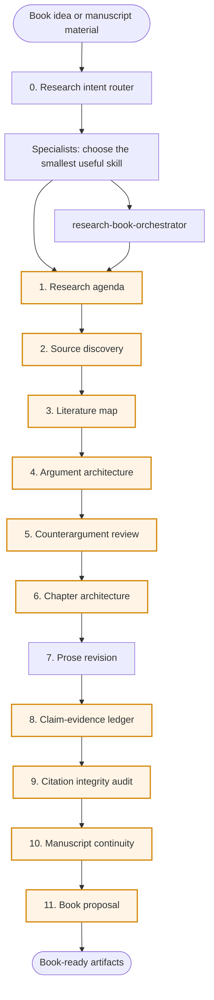
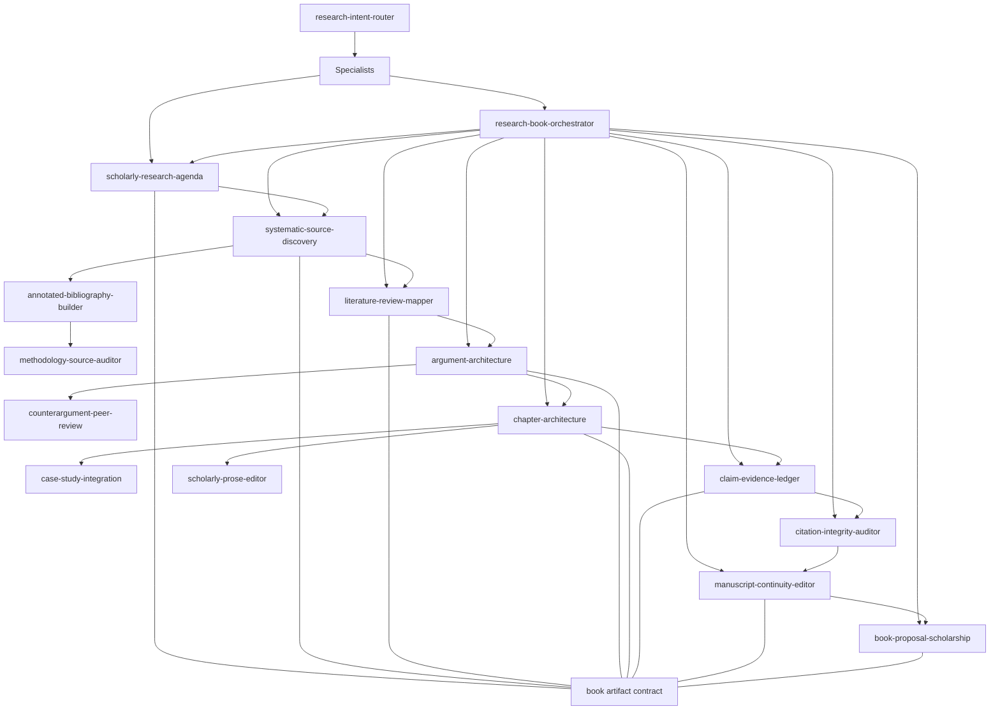

# Research book plugin architecture

This package is organized as a book-length research workflow, not a loose set of writing prompts. Each stage has a skill, an expected artifact, and a quality gate before the next stage.

## How to read this file

- Use the flow diagram for the high-level sequence.
- Use the stage matrix to see which skill produces which artifact.
- Check the quality gates before moving from planning to drafting or from drafting to audit.
- Use `MODE_REGISTRY.md` as the short routing reference.
- Use `shared/contracts/book/book_artifact.schema.json` when JSON artifacts are requested or examples are changed.
- Use `docs/SKILL_README_TEMPLATE.md` when adding or refreshing skill README files.

## Pipeline flow



You can enter the workflow at any stage. The research intent router chooses the smallest useful skill first. The orchestrator handles broader multi-stage workflow planning.

## Stage matrix

| Stage | Primary skill | Artifact | Gate |
|---|---|---|---|
| 0. Intent routing | `research-intent-router` | Research intent route; non-contract routing output | Smallest useful skill chosen; deep lookup justified or declined |
| 0.1. Orchestration | `research-book-orchestrator` | Workflow plan | Correct route chosen; assumptions labeled |
| 1. Agenda | `scholarly-research-agenda` | Book Research Agenda | Question is answerable; scope has boundaries |
| 2. Source discovery | `systematic-source-discovery` | Source Discovery Log | Search venues separated from verified sources |
| 3. Literature mapping | `literature-review-mapper` | Literature Map | Consensus, controversy, and gaps separated |
| 4. Argument design | `argument-architecture` | Thesis Tree | Claims, warrants, evidence needs, and dependencies explicit |
| 5. Adversarial critique | `counterargument-peer-review` | Peer-Review Style Critique | Strong rival explanations represented |
| 6. Chapter planning | `chapter-architecture` | Chapter Brief | Chapter function advances the thesis |
| 7. Prose revision | `scholarly-prose-editor` | Revised Passage or Style Sheet | No new unsupported claims added |
| 8. Evidence audit | `claim-evidence-ledger` | Claim-Evidence Ledger | High-risk claims flagged before citation polish |
| 9. Citation audit | `citation-integrity-auditor` | Citation Integrity Audit | Source-claim fit checked; missing locators flagged |
| 10. Continuity | `manuscript-continuity-editor` | Continuity Review | Concepts, thesis, tone, and repetition tracked across chapters |
| 11. Proposal | `book-proposal-scholarship` | Research Book Proposal | Comparable titles and positioning claims marked by verification status |

## Skill dependency graph



## Data and artifact levels

| Level | Meaning | Examples |
|---|---|---|
| Raw material | User notes, drafts, source lists, excerpts, broad premises | Book idea, chapter draft, reading notes |
| Structured artifact | Stage output with stable fields | Agenda, search log, literature map, thesis tree |
| Audited artifact | Artifact after evidence or citation checks | Claim ledger, citation audit, continuity review |
| Proposal artifact | External-facing synthesis | Book proposal, sample-material plan |

JSON artifacts must use `schema_version: "book-artifact-v1"` and one artifact type listed in the contract.

## Quality gates

| Gate | Blocks on | Why it matters |
|---|---|---|
| Intent route gate | Unclear research intent, artifact stage, source access, or risk level | Prevents noisy skill chains and premature deep lookup |
| Scope gate | Vague central question or undefined audience | Prevents scope drift |
| Source gate | Unclear source strategy or undocumented search path | Prevents cherry-picking |
| Literature gate | One-sided literature map | Prevents literature blindness |
| Argument gate | Topic outline without thesis dependency | Prevents chapters that only summarize |
| Counterargument gate | No strong rival explanation | Prevents brittle thesis framing |
| Chapter gate | Chapter has a topic but no argumentative function | Prevents chapter drift |
| Evidence gate | Claims stronger than evidence | Prevents overclaiming |
| Citation gate | Citation near a claim but not verified as support | Prevents source-claim mismatch |
| Continuity gate | Contradictions, repetition, or concept drift across chapters | Prevents manuscript-level incoherence |
| Proposal gate | Unverified comparable titles or overstated positioning | Prevents fabricated market claims |

## Package structure

```text
.
  plugin manifest directory/plugin.json
  docs/
    ARCHITECTURE.md
    SKILL_INDEX.md
    WORKFLOW_PLAYBOOK.md
    QUALITY_STANDARD.md
  examples/
    book_artifacts/
  scripts/
    check_book_artifact_contract.py
    validate_plugin.py
  shared/
    contracts/book/book_artifact.schema.json
  skills/
    research-book-orchestrator/
      SKILL.md
      agents/openai.yaml
      assets/
```

The `skills/*/assets/` folders currently hold templates or checklists. Nothing depends on that folder name today. If the package later needs academic-pipeline naming, those folders can be renamed to `templates/` in one mechanical cleanup.
