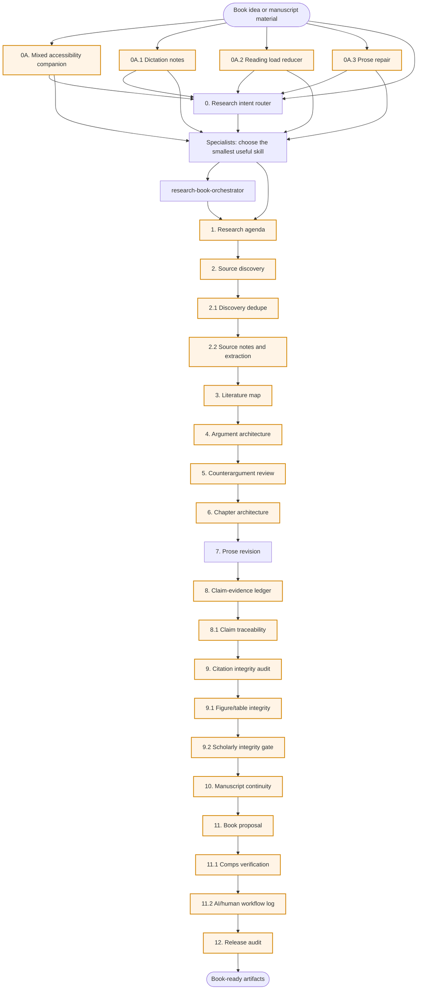
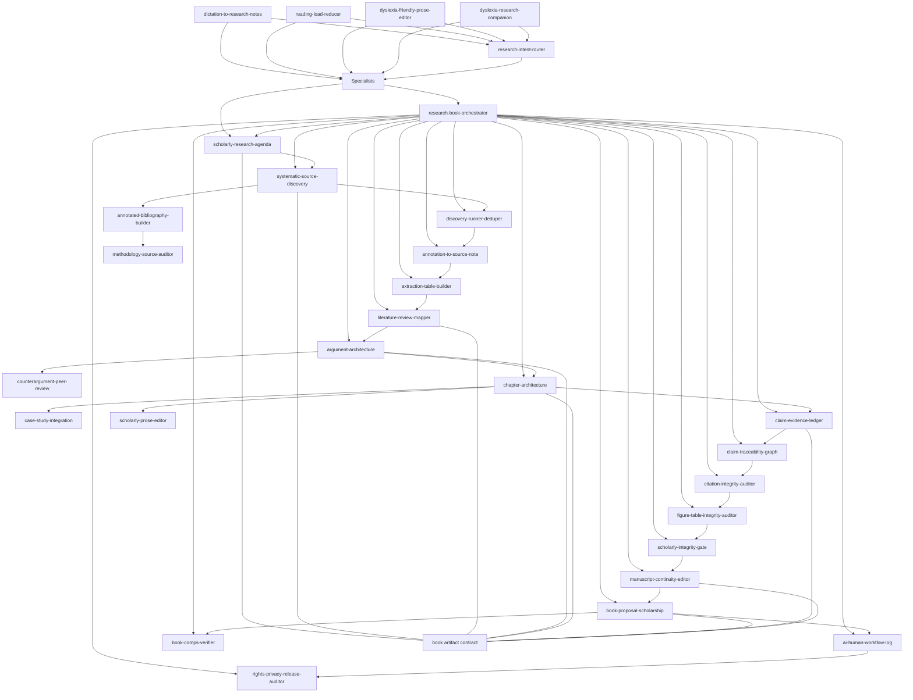

# Research book plugin architecture

This package is organized as a book-length research workflow, not a loose set of writing prompts. Each stage has a skill, an expected artifact, and a quality gate before the next stage. Accessibility skills can be used before or between stages when rough input, dictation, spelling ambiguity, dense material, or reading fatigue blocks the next scholarly action.

## How to read this file

- Use the flow diagram for the high-level sequence.
- Use the stage matrix to see which skill produces which artifact.
- Check the quality gates before moving from planning to drafting or from drafting to audit.
- Use `MODE_REGISTRY.md` as the short routing reference.
- Use `shared/contracts/book/book_artifact.schema.json` when JSON artifacts are requested or examples are changed.
- Use `docs/PROCESS_PASSPORT.md` when a durable artifact is handed to another skill, reviewer, gate, release step, or submission workflow.
- Use `docs/CORPUS_REPRESENTATIVENESS_TAXONOMY.md` when a source set is used to imply coverage, balance, consensus, novelty, or missing literature.
- Use `docs/SKILL_README_TEMPLATE.md` when adding or refreshing skill README files.

## Pipeline flow



You can enter the workflow at any stage. The research intent router chooses the smallest useful skill first. The orchestrator handles broader multi-stage workflow planning.

## Stage matrix

| Stage | Primary skill | Artifact | Gate |
|---|---|---|---|
| 0A. Mixed accessibility companion | `dyslexia-research-companion` | Low-load route, cleaned structure, ambiguity table, or next action | Mixed or unclear bottleneck routed; meaning preserved; ambiguity marked; one useful next action visible |
| 0A.1 Dictation notes | `dictation-to-research-notes` | Cleaned note table | Spoken ideas segmented into claims, questions, evidence needs, ambiguities, and next actions |
| 0A.2 Reading load | `reading-load-reducer` | Read/skim/park/skip triage | Source access labeled; close-reading targets visible |
| 0A.3 Prose repair | `dyslexia-friendly-prose-editor` | Meaning-preserving repaired passage | Spelling and sentence repair does not change claim meaning or hide evidence gaps |
| 0. Intent routing | `research-intent-router` | Research intent route; non-contract routing output | Smallest useful skill chosen; deep lookup justified or declined |
| 0.1. Orchestration | `research-book-orchestrator` | Workflow plan | Correct route chosen; assumptions labeled |
| 1. Agenda | `scholarly-research-agenda` | Book Research Agenda | Question is answerable; scope has boundaries |
| 2. Source discovery | `systematic-source-discovery` | Source Discovery Log | Search venues separated from verified sources |
| 2.1. Candidate processing | `discovery-runner-deduper` | Candidate Matrix and Search-Log Update | Completed searches, candidates, duplicates, and screening decisions are separated |
| 2.2. Source notes and extraction | `annotation-to-source-note`, `extraction-table-builder` | Source Notes, Extraction Tables, Source Matrices | Notes preserve quote, paraphrase, metadata, and locator gaps before comparison |
| 3. Literature mapping | `literature-review-mapper` | Literature Map | Consensus, controversy, and gaps separated |
| 4. Argument design | `argument-architecture` | Thesis Tree | Claims, warrants, evidence needs, and dependencies explicit |
| 5. Adversarial critique | `counterargument-peer-review` | Peer-Review Style Critique | Strong rival explanations represented |
| 6. Chapter planning | `chapter-architecture` | Chapter Brief | Chapter function advances the thesis |
| 7. Prose revision | `scholarly-prose-editor` | Revised Passage or Style Sheet | No new unsupported claims added |
| 8. Evidence audit | `claim-evidence-ledger` | Claim-Evidence Ledger | High-risk claims flagged before citation polish |
| 8.1. Claim traceability | `claim-traceability-graph` | Claim Traceability Graph | Claims trace to source notes, citekeys, locators, or repair tasks |
| 9. Citation audit | `citation-integrity-auditor` | Citation Integrity Audit | Source-claim fit checked; missing locators flagged |
| 9.1. Figure/table integrity | `figure-table-integrity-auditor` | Figure Table Integrity Audit | Captions, axes, data provenance, duplicate visual risk, rights, and claim support are checked |
| 9.2. Scholarly integrity gate | `scholarly-integrity-gate` | Scholarly Integrity Audit | AI research failure modes, shortcut reliance, frame-lock, and human checkpoints are cleared, held, or overridden |
| 10. Continuity | `manuscript-continuity-editor` | Continuity Review | Concepts, thesis, tone, and repetition tracked across chapters |
| 11. Proposal | `book-proposal-scholarship` | Research Book Proposal | Comparable titles and positioning claims marked by verification status |
| 11.1. Comparable-title verification | `book-comps-verifier` | Comparable Title Verification | Comps, publication details, and positioning claims are checked before submission |
| 11.2. AI/human workflow log | `ai-human-workflow-log` | AI Human Workflow Log | Tool use, affected sections, human decisions, override reasons, and disclosure notes are recorded |
| 12. Release audit | `rights-privacy-release-auditor` | Rights Privacy Release Audit | Privacy, copyright, quote, license, credential, and local metadata risks are checked before sharing |

## Skill dependency graph



## Data and artifact levels

| Level | Meaning | Examples |
|---|---|---|
| Raw material | User notes, drafts, source lists, excerpts, broad premises | Book idea, chapter draft, reading notes |
| Structured artifact | Stage output with stable fields | Agenda, search log, literature map, thesis tree |
| Prepared source work | Source-bound notes, extraction rows, deduped candidates, screening records | Source notes, source matrix, duplicate clusters |
| Audited artifact | Artifact after evidence or citation checks | Claim ledger, citation audit, continuity review |
| Proposal artifact | External-facing synthesis | Book proposal, sample-material plan |

JSON artifacts must use `schema_version: "book-artifact-v1"` and one artifact type listed in the contract.

Durable cross-skill artifacts should set `handoff_artifact: true` and include `process_passport`. The passport records source basis, source access level, corpus coverage, evidence status, tool use, human verification status, unresolved risks, and handoff limits so downstream skills do not erase uncertainty or upgrade verification without an actual verification step. Casual replies, raw user material, non-persisted routing, and private accessibility cleanup are not handoff artifacts by default.

## Quality gates

| Gate | Blocks on | Why it matters |
|---|---|---|
| Accessibility gate | Rough notes, dictation errors, spelling ambiguity, dense material, or reading fatigue hide the user's intended claim or next action | Prevents text friction from being mistaken for weak analysis |
| Dictation gate | Spoken ideas are mixed with transcript noise, repetition, and unclear claims | Prevents voice-capture friction from becoming argument confusion |
| Reading-load gate | Dense material or source volume prevents close reading | Prevents premature synthesis from unread or thinly accessed material |
| Prose-repair gate | Spelling, grammar, or sentence-boundary friction blocks review of existing prose | Prevents surface errors from being mistaken for weak argument while keeping meaning stable |
| Intent route gate | Unclear research intent, artifact stage, source access, or risk level | Prevents noisy skill chains and premature deep lookup |
| Scope gate | Vague central question or undefined audience | Prevents scope drift |
| Source gate | Unclear source strategy, undocumented search path, or missing corpus-representativeness label | Prevents cherry-picking and false field-coverage claims |
| Candidate gate | Completed searches, duplicate records, screening decisions, and corpus-representativeness limits are mixed | Prevents false corpus confidence |
| Source-note gate | Quotes, paraphrases, summaries, interpretations, metadata, or locators are mixed | Prevents weak notes from becoming draft claims |
| Extraction gate | Sources are compared before extraction is even enough | Prevents premature synthesis |
| Literature gate | One-sided, thin, stale, convenience-selected, or unknown-coverage literature map | Prevents literature blindness |
| Argument gate | Topic outline without thesis dependency | Prevents chapters that only summarize |
| Counterargument gate | No strong rival explanation | Prevents brittle thesis framing |
| Chapter gate | Chapter has a topic but no argumentative function | Prevents chapter drift |
| Evidence gate | Claims stronger than evidence | Prevents overclaiming |
| Traceability gate | Claims do not connect to source notes, citekeys, locators, or repair tasks | Prevents orphan claims |
| Citation gate | Citation near a claim but not verified as support | Prevents source-claim mismatch |
| Figure/table gate | Captions, axes, data provenance, duplicate visuals, rights, or visual claim support are unclear | Prevents polished visuals and tables from acting as unsupported evidence |
| Scholarly integrity gate | AI-assisted workflow, generated synthesis, automated extraction, or computed result lacks provenance or human checkpoint | Prevents implementation bugs, hallucinated evidence, methodology fabrication, shortcut reliance, and frame-lock from entering manuscripts |
| Continuity gate | Contradictions, repetition, or concept drift across chapters | Prevents manuscript-level incoherence |
| Proposal gate | Unverified comparable titles or overstated positioning | Prevents fabricated market claims |
| AI/human workflow gate | AI tool use, affected sections, human decisions, disclosure basis, or override reasons are missing before external sharing | Prevents opaque AI/human collaboration and unsupported disclosure claims |
| Release gate | Private notes, copied source text, missing quote locators, license problems, or credentials appear in shared artifacts | Prevents avoidable release risk |

## Package structure

```text
.
  plugin manifest directory/plugin.json
  docs/
    ARCHITECTURE.md
    SKILL_INDEX.md
    WORKFLOW_PLAYBOOK.md
    QUALITY_STANDARD.md
  examples/
    book_artifacts/
  scripts/
    check_book_artifact_contract.py
    validate_plugin.py
  shared/
    contracts/book/book_artifact.schema.json
  skills/
    research-book-orchestrator/
      SKILL.md
      agents/openai.yaml
      assets/
```

The `skills/*/assets/` folders currently hold templates or checklists. Nothing depends on that folder name today. If the package later needs academic-pipeline naming, those folders can be renamed to `templates/` in one mechanical cleanup.
